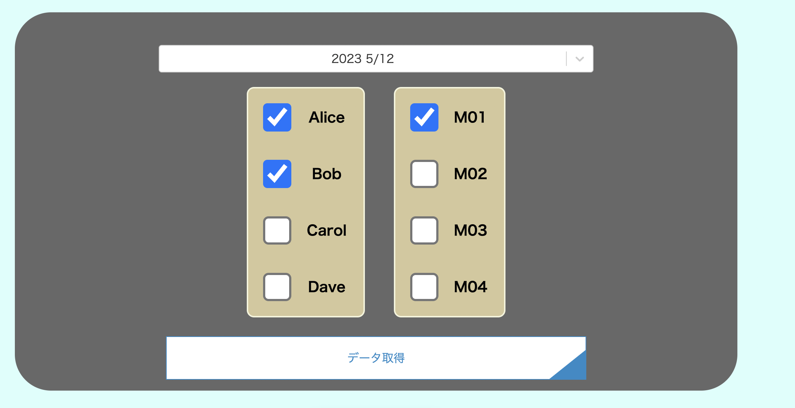
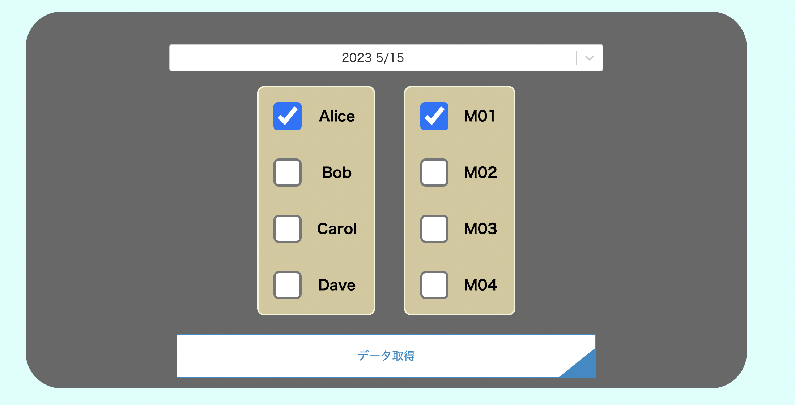

# グラフ表示 Web アプリケーション（グラフアプリケーション）

## 確認済みの実行環境と動作環境

mac(M1)
npm インストール済み

ブラウザ：Chrome,safari

## 実行手順

npm から以下ののパッケージをインストールしてください

```
npm install --save react-chartjs-2 chart.js
npm install moment chartjs-adapter-moment --save
npm install react-select
npm install lodash
npm install react-helmet
```

同ディレクトリで以下のコマンドを実行して、ローカルでグラフアプリケーションを配備します。

```bash
npm run dev
# or
yarn dev
# or
pnpm dev
```

その後[http://localhost:3000](http://localhost:3000) に配備された、グラフアプリケーションにアクセスします。（ポート番号はずれる可能性あり）

## 使用方法

以下２つの画像のように日時、人（Alice,Bob など)、場所（M0[1-4])を指定します。




次に、「データ取得」ボタンをクリックし、./public/test からデータを取得します。

最後に「更新」ボタンをクリックすることで、取得したデータをグラフに表示させます。

本ポートフォリオでは、以下の４つのサンプルログを用意しています。
2023 5/12 日　 Alice M01
2023 5/12 日　 Alice M02
2023 5/12 日　 Bob M01
2023 5/15 日　 Alice M01
